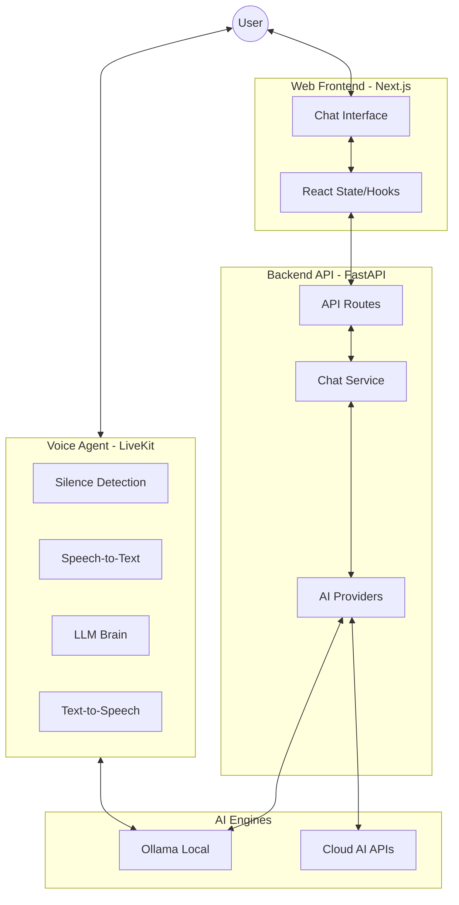

# 🤖 OpenChat AI Assistant

A full-stack AI assistant featuring real-time text chat, image understanding, and low-latency voice interactions.

## 🌟 Features

-   **💬 Multimodal Chat**: Seamlessly switch between text and image inputs.
-   **👁️ Image Understanding**: Upload photos and ask the AI to describe or analyze them using vision models.
-   **🎙️ LiveKit Voice**: Real-time, low-latency voice conversations powered by a dedicated AI agent.
-   **🏠 Local-First AI**: Powered by Ollama for privacy and cost-efficiency, with cloud fallback options.
-   **⚡ Streaming Responses**: Server-Sent Events (SSE) for a responsive, "typing" feel.

## 🏗 Architecture



## 🛠 Tech Stack

| Layer | Technology | Description |
| :--- | :--- | :--- |
| **Frontend** | Next.js 16, React 19 | Framework and UI library |
| **Styling** | Tailwind CSS 4, shadcn/ui | Modern utility-first styling |
| **Backend** | FastAPI, Python 3.13 | High-performance async API |
| **Package Mgr** | uv | Fast Python package management |
| **Voice** | LiveKit | Real-time audio infrastructure |
| **AI (Local)** | Ollama | Local model hosting |
| **Models** | Gemma 3, Llava | LLM and Vision models |

## 🚀 Getting Started

### 1. Local AI Setup
Install [Ollama](https://ollama.ai/) and pull the required models:
```bash
ollama pull gemma3:1b  # For chat & voice
ollama pull llava      # For vision/images
```

### 2. Backend API
```bash
cd api
uv sync
# Create .env from .env.example and add your keys
uv run fastapi dev
```

### 3. Web Frontend
```bash
cd web
npm install
npm run dev
```

### 4. Voice Agent
```bash
cd agent
pip install livekit-agents livekit-plugins-ollama livekit-plugins-silero livekit-plugins-deepgram python-dotenv
python agent.py dev
```

## ⚙️ Configuration

The application uses `.env` files for sensitive configuration. **Never commit your `.env` file to GitHub.**

**Key Variables:**
- `OLLAMA_BASE_URL`: URL of your local Ollama instance.
- `LIVEKIT_URL`, `LIVEKIT_API_KEY`, `LIVEKIT_API_SECRET`: Required for the voice feature.

## 🛠 Workflow

1.  **Text/Image Flow**: `User` $\rightarrow$ `Next.js` $\rightarrow$ `FastAPI` $\rightarrow$ `Ollama` $\rightarrow$ `Streaming Response` $\rightarrow$ `User`.
2.  **Voice Flow**: `User` $\rightarrow$ `LiveKit Room` $\rightarrow$ `Python Agent` $\rightarrow$ `Ollama` $\rightarrow$ `Voice Response` $\rightarrow$ `User`.
