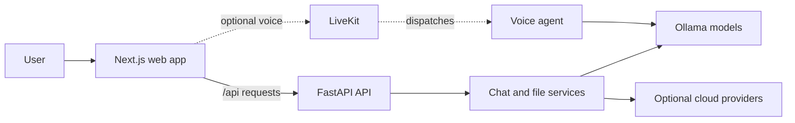

# OpenChat AI Assistant

OpenChat is a self-hosted AI chat app with a Next.js interface and a FastAPI backend. It streams replies from local Ollama models, supports image questions, extracts text from common documents, and can connect to optional cloud providers and LiveKit voice services.

## Features

- Streamed chat responses over Server-Sent Events (SSE).
- Local Ollama models, with optional cloud providers as fallbacks.
- Image uploads for vision-capable models.
- Text, Markdown, CSV, JSON, code, PDF, and DOCX file attachments.
- Large-file retrieval using Ollama embeddings and in-memory per-upload indexes.
- Conversation history stored in browser local storage.
- Optional LiveKit voice sessions.
- Dark and light themes.

## Architecture



## Requirements

- Node.js 24 (Node.js 20.9 or newer is required by the frontend package).
- Python 3.13 and [`uv`](https://docs.astral.sh/uv/).
- [Ollama](https://ollama.com/) for local models.
- Git (optional, for cloning the repository).

## Quick start

### 1. Start Ollama

Install and start Ollama, then pull a chat model. For example:

```bash
ollama pull gemma3:1b
```

For image questions, pull a vision model too:

```bash
ollama pull llava
```

Large document retrieval uses `nomic-embed-text`. The backend attempts to pull it from Ollama when needed. You can pull it ahead of time:

```bash
ollama pull nomic-embed-text
```

### 2. Start the API

In a terminal at the repository root:

```bash
cd api
uv sync
uv run fastapi dev app/main.py
```

The API is available at <http://127.0.0.1:8000>. Interactive API docs are at <http://127.0.0.1:8000/docs>.

### 3. Start the web app

In another terminal:

```bash
cd web
npm install
npm run dev
```

Open <http://localhost:3000>. The Next.js server forwards `/api/*` requests to the backend at `http://localhost:8000` by default.

## Configuration

The API reads settings from environment variables and `api/.env`. Start from the example file if you need optional integrations:

```bash
cp api/.env.example api/.env
```

On Windows PowerShell, use `Copy-Item api/.env.example api/.env` instead. The local Ollama setup works without cloud API keys. Keep `.env` files, API keys, and other secrets out of source control.

### Common API settings

| Variable | Default | Purpose |
|---|---|---|
| `OLLAMA_HOST` | `http://localhost:11434` | Ollama server address. |
| `OLLAMA_ENABLED` | `true` | Enable the local Ollama provider. |
| `MAX_UPLOAD_MB` | `4` | Maximum document upload size in megabytes. Increase locally, for example to `50`, for larger files. |
| `ALLOW_CLOUD_FALLBACK` | `true` | Allow configured cloud providers when a selected/local model fails before streaming starts. |
| `REQUEST_TIMEOUT_SECONDS` | `120` | Request timeout for cloud providers. |
| `OLLAMA_TIMEOUT_SECONDS` | `600` | Request timeout for Ollama. |
| `CORS_ORIGINS` | `["http://localhost:3000"]` | Allowed browser origins when calling the API directly. |

For cloud providers, configure the relevant API key and optional model/base URL in `api/.env`. Provider settings include Anthropic, OpenAI, Gemini, Grok, and Meta. The browser never receives backend API keys.

### Large file uploads

The default upload cap is 4 MB, suitable for hosted deployments. For local use, set this in `api/.env`:

```dotenv
MAX_UPLOAD_MB=50
```

Small files retain the direct context flow, with extracted text capped at 8,000 characters. Larger files are split into overlapping chunks, embedded with `nomic-embed-text`, and searched for the most relevant passages when you ask a question. The current index is held in backend memory for the lifetime of the running process; after a restart, attach the file again.

## Voice setup (optional)

Voice calls require a LiveKit project and a running voice agent. Configure `LIVEKIT_URL`, `LIVEKIT_API_KEY`, `LIVEKIT_API_SECRET`, and `LIVEKIT_AGENT_NAME` in `api/.env`, then run the agent from the `agent/` directory using the dependencies listed by that agent. Keep the LiveKit API secret on the backend. Voice functionality is optional; chat does not require it.

## Docker Compose

The Compose file starts the API and web app. Configure `api/.env` first, then run:

```bash
docker compose up --build
```

The web app will be at <http://localhost:3000> and the API at <http://localhost:8000>. To run Ollama in Docker instead of on the host, start its optional profile:

```bash
docker compose --profile ollama up --build
```

Set `OLLAMA_HOST=http://ollama:11434` for the API service when using that profile. Pull the required Ollama models into the persistent Ollama volume.

## Development and tests

### API

```bash
cd api
uv run ruff check .
uv run ruff format --check .
uv run pytest
```

### Web

```bash
cd web
npm run typecheck
npm run build
```

## API endpoints

| Method | Endpoint | Description |
|---|---|---|
| `GET` | `/api/health` | API health check. |
| `GET` | `/api/models` | Lists available local and configured cloud models. Use `?refresh=true` to refresh the provider cache. |
| `POST` | `/api/upload` | Extracts supported document text or indexes a large document for retrieval. Multipart field: `file`. |
| `POST` | `/api/chat` | Streams a chat reply as SSE. |
| `POST` | `/api/voice/token` | Creates a short-lived LiveKit participant token and dispatches the voice agent. |

## Project layout

```text
api/
  app/
    main.py                 FastAPI app, routes, middleware, and CORS
    core/config.py          Environment-based settings
    routes/                 Chat, upload, health, model, and voice endpoints
    providers/              Ollama and cloud provider adapters
    services/               Streaming chat and large-file retrieval
  tests/                    API tests
web/
  app/                      Next.js routes and global styles
  components/chat/          Chat UI and composer
  hooks/                    Chat and model state
  lib/                      API client, types, and helpers
agent/                      Optional LiveKit voice agent
```

## Troubleshooting

- **No model appears:** Check that Ollama is running and that a chat model is installed with `ollama list`.
- **Image questions fail:** Use a vision-capable model such as `llava` and select it in the model picker if needed.
- **A document is too large:** The API reports the configured `MAX_UPLOAD_MB` limit. Raise it for local use and restart the API.
- **Large-file processing fails:** Confirm Ollama is reachable and that `nomic-embed-text` can be pulled and run.
- **The web app cannot reach the API:** Confirm the backend is running on port 8000. Set `API_URL` in `web/.env.local` if it uses a different address, then restart Next.js.
- **Cloud fallback is unavailable:** Configure that provider’s backend API key and make sure `ALLOW_CLOUD_FALLBACK` is enabled if you want fallback behavior.
